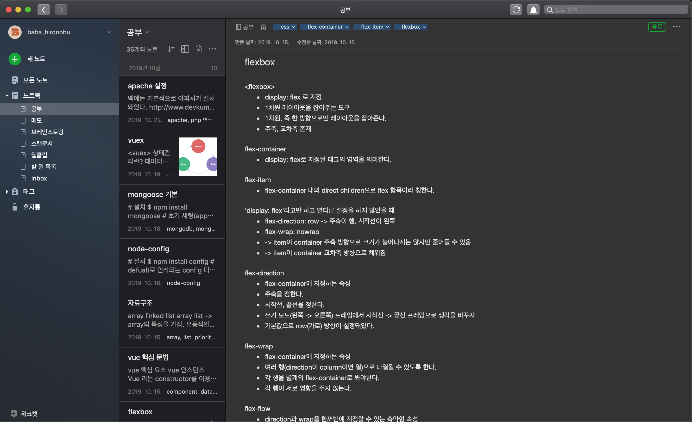
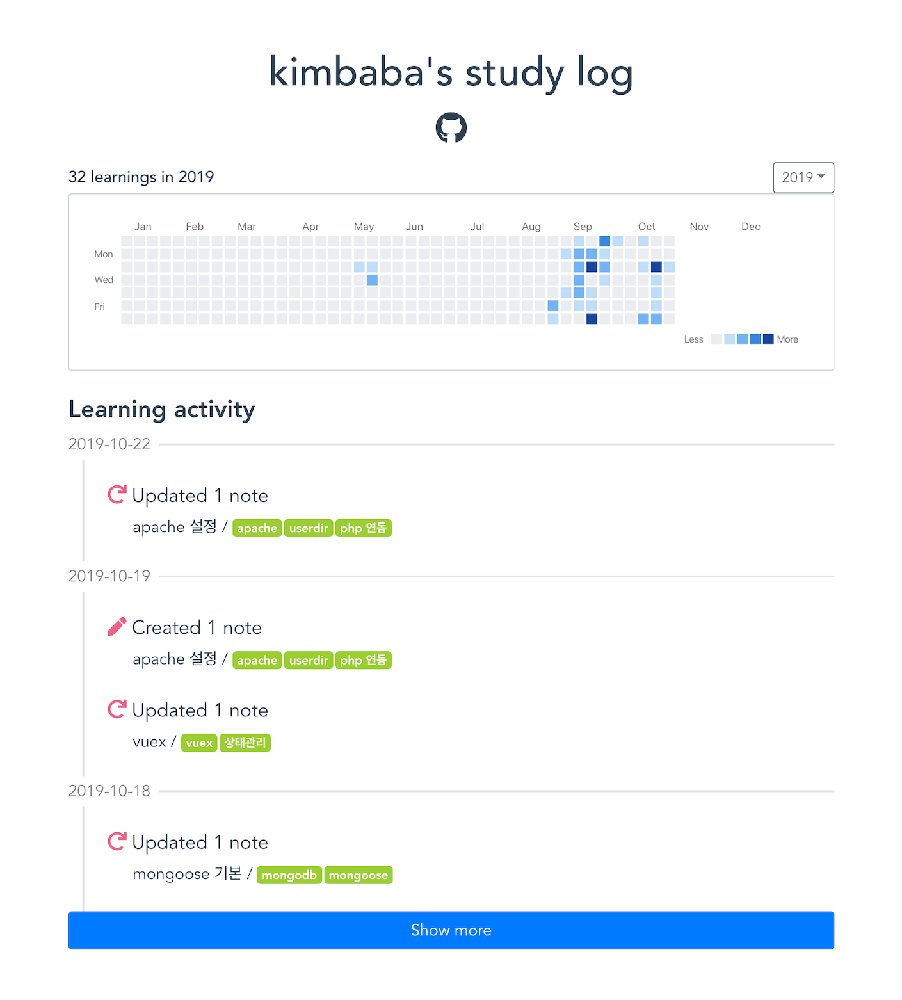

# Study Log Legacy
에버노트 api를 이용해 공부한 기록을 볼 수 있는 웹앱을 만들어봤습니다. 처음으로 결과물이 나온 개인 프로젝트입니다. 예쁘게 봐주세요^^

## 프로젝트를 다시 만들고 있는 중입니다.
typescript, react를 사용할 예정이고 기능을 좀 더 보완할 예정입니다.

## 사용하는 노트 앱을 에버노트에서 노션으로 바꿨습니다.
공식 노션 api가 릴리즈되는 것을 기다릴지, 에버노트용 study log를 계속 관리할 지 방향을 여러 가지로 고민중입니다.

## 프로세스 소개
1. 공부한 내용을 모두 에버노트에 작성해 놓습니다.  

2. 작성해놓은 노트들의 정보를 [에버노트 api](https://dev.evernote.com/)를 통해 얻습니다.

3. 에버노트 api를 통해 얻은 데이터를 저의 필요에 따라 가공해 mongoDB에 저장해놓습니다.  

4. DB에 저장한 데이터를 express로 직접 만든 rest api로 불러와 vue로 만든 웹앱에 보기 좋게 띄워주면 다음과 같은 화면을 볼 수 있습니다.

## 도움을 받은 요소들
- [evernote SDK for javascript](http://dev.evernote.com/doc/start/javascript.php)
- OAuth1.0: 에버노트 api는 OAuth2.0을 사용하지 않는다.
- [vue-calendar-heatmap](https://github.com/WildCodeSchool/vue-calendar-heatmap)

## 해야 할 일
[깃허브 프로젝트 참고](https://github.com/BABAHIRONOBU/study_log_legacy/projects/1)

